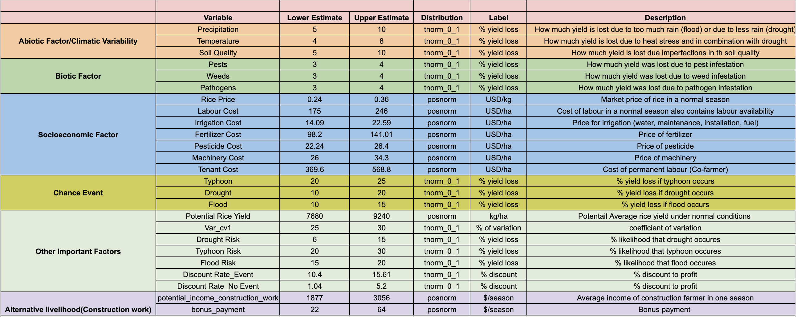
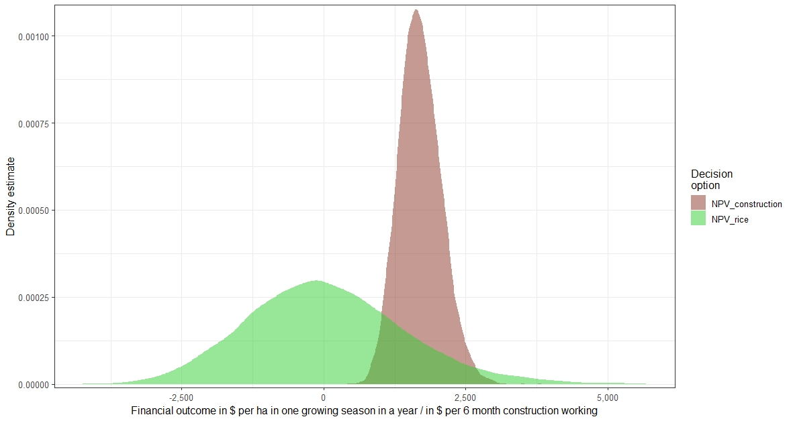
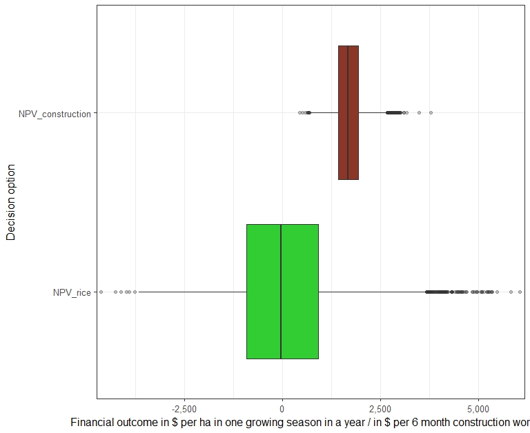
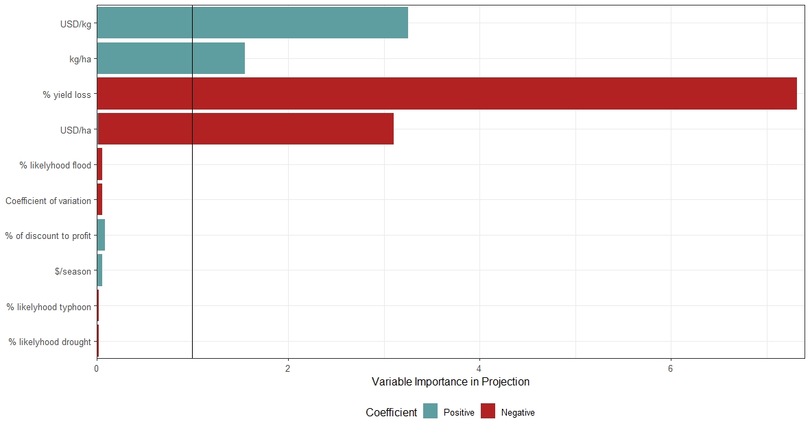
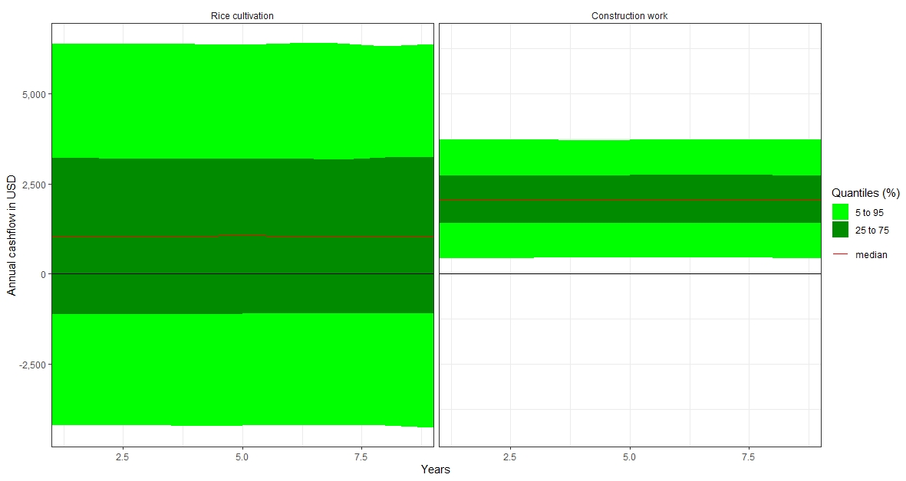

<style>
body {
text-align: justify}
</style>

```{r setup, include=FALSE}
knitr::opts_chunk$set(echo = TRUE)
library(knitr)
library(decisionSupport)
library(ggplot2)
library(DiagrammeR)
```

```{r setup add_R_bib, include=FALSE}
knitr::write_bib(c(.packages(),
                   'knitr', 'decisionSupport', 'ggplot2','DiagrammeR'), 'bib/packages.bib')
```

# Introduction

## Rice as a staple food

Rice is among the three leading food crops in the world and together they directly supply more than 50% of all calories consumed by the  human population. It has the second largest area harvested with 154 million ha per year and out of this, human consumption accounts for 85% of the total production and this provides 21% of global human per capita energy and 15% of per capita protein. @haefele_importance_2007  

### Rice and its importance
Rice remains the agricultural commodity with foremost political and economic significance in the Philippines. As of 2021, Philippines rank 13 on the top rice producing countries @vviiddeeooss_rice_2021. As a major staple of Philippines, rice accounts for 35% of average calorie intake of the population and as much as 60-65% of the households in the lowest income quartile @leocadio_s_bridging_2000. Moreover, rice farming is the source of income and employment of 11.5 million farmers and family members. Rice contributes 13% to the Consumer Price Index (CPI), 16 percent to the Gross Value Added (GVA) of agriculture, and 3.5% to the Gross Domestic Product (GDP)@leocadio_s_bridging_2000. Due to its economic importance, rice has become the central focus of government agricultural policies.

## Impact of climate change on rice production in the Phlippines
However, rice plant growth and yield is mainly influenced by many biotic and abiotic factors including  climatic factors, agronomic factors, pests and nutrient availability in the soil etc. @hasanuzzaman_effect_2020 Extreme conditions of these factors can badly affect rice growth and development.
Rice is sensitive to different aboitic stresses that will be exacerbated with more climate extremes under climate change @mohanty_significance_2012  of which include;  

1.High temperatures coinciding with critical developmental stages  
2.Floods causing complete or partial submergence  
3.Salinity, which is often associated with sea-water inundation  
4.Drought spells that are highly deleterious to rainfed systems  

With climate change that increases the intensity of these abiotic stresses in the Philippines. The future of rice cultivation is uncertain and becomes a risky investment. This is because the delayed rainfall made farmers shift the planting date to meet the time the rain comes. If the farmers won't do this, the rice plant will not survive the drought. It is also expected that there will be an increase in pest,pathogen and weed infestation and this will also require more investment in pesticide and herbicide usage which may lead to negative impact in the environment due to its accumulation in the soil and water bodies and in the long run affect human health.
Also, there has been severe reduction in yields over the years which maybe attributed to climate change as well.

## Identified decision strategy
Through literature, we assessed the profitability of rice farming in the past and used this as a basis to model a strategy as to how farmers can cope with climate change.
We try to model a strategic decision for the farmers thus; 
1.Should farmers in the Philippines continue to plant rice in the coming decades with the uncertainty of its profitability? 
2.Should the farmer take up a construction work with the certainty of an income?

# Methodology

There are steps toward accomplished decision analysis model for rice farmers in Philippines.  

1. Expert for identification
in this step, we need to set criteria.  

+ Their experience, the informants need to have at least 5 years of doing rice farming.  
+ Their expertise, in case of experts who is not rice farmer they need to have experience on working in the rice area.  
+ Their willingness, all informants are willing to be part of the project without forcing, or being manipulate to join.  

2. Development of model  

In this step, we do data collection by participatory approach to get data that are needed to input into model and the accurate data from the informants.  

3. Probability assessment  

In this step, we quantify uncertainty with experts and do confident interval with experts.  

4. Simulation and assessment  

In this step, we use Monte carlo simulation function to calculate NPV, and visualize probability distribution.  


## Steps 
```{r, echo=FALSE }
knitr::include_graphics('steps.png')
```
<center>Figure 1: Steps have been taken to create model</center>

## Plot Pathway Impact


We use packages `DiagrammeR` by @R-DiagrammeR to create Pathway impact model. In this step it is required to use the R function `install.packages()`. After installing the package `DiagrammeR` and was loaded to the R library using the `library()` function.   
Then we use a function called `mermaid` to do a valid graph or sequence diagram specification, in this case we also use `TB` to arrange sequence from top to bottom.

We interview farmers and experts and obtain the data that we need to use to calculate rice NPV, abiotic, biotic and socio-economic factors are identified in the model, according to the informant, the factors featured in the model are the factors that has impacts toward rice yield.  

Abiotic factors in this model are grouped by orange color, biotic factors in this model are grouped by green color and socio-ecinomic factors are group by light blue color.

The chance events are portrayed in yellow color with dash-array. The costs are grouped in light red color.Then, we deduct the costs to have net income.  


```{r pressure, echo=FALSE}
mermaid("graph TB
        P(Precipitation) -->Y(Rice Yield); linkStyle 0 stroke:black, stroke-width:1.5px 
        T(Temperature)-->Y(Rice Yield); linkStyle 1 stroke:black, stroke-width:1.5px
        SQ(Soil Quality)-->Y(Rice Yield); linkStyle 2 stroke:black, stroke-width:1.5px
        WD(Weeds)-->Y(Rice Yield); linkStyle 3 stroke:black, stroke-width:1.5px
        PG(Pathogen)--> Y(Rice Yield); linkStyle 4 stroke:black, stroke-width:1.5px
        PT(Pest)--> Y(Rice Yield); linkStyle 5 stroke:black, stroke-width:1.5px
        RP(Rice Price)-->Y(Rice Yield);linkStyle 6 stroke:black, stroke-width:1.5px
        TYP(Typhoon)-->Y(Rice Yield); linkStyle 7 stroke-dasharray: 5 5, stroke-width:1.5px
        D(Drought)-->Y(Rice Yield); linkStyle 8 stroke-dasharray: 5 5, stroke-width:1.5px
        F(Flood)-->Y(Rice Yield); linkStyle 9 stroke-dasharray: 5 5,stroke-width:1.5px
        Y(Rice Yield)-->I(Income); linkStyle 10 stroke:green, stroke-width:1.5px
        CC(Chemical cost)-->TC(Total cost); linkStyle 11 stroke:black, stroke-width:1.5px
        IRC(Irrigation cost)-->TC(Total cost); linkStyle 12 stroke:black, stroke-width:1.5px
        FLC(Fertilizer Cost)-->TC(Total cost); linkStyle 13 stroke:black, stroke-width:1.5px
        LC(Labor cost)-->TC(Total cost); linkStyle 14 stroke:black, stroke-width:1.5px
        MC(Machinery cost)-->TC(Total cost); linkStyle 15 stroke:black, stroke-width:1.5px
        TNC(Tenant cost)-->TC(Total cost); linkStyle 16 stroke:black, stroke-width:1.5px
        TC(Total cost)-->IN;linkStyle 17 stroke: red, stroke-width:1.5px
        I(Income)-->IN(Net Income) ;linkStyle 18 stroke: green, stroke-width:1.5px
        
        style P fill:#f96, color:#fff
        style T fill:#f96, color:#fff
        style WD fill:#BFFF00, color:#fff
        style SQ fill:#f96, color:#fff
        style PG fill:#BFFF00, color:#fff
        style PT fill:#BFFF00, color:#fff
        style RP fill:#87cefa, color:#fff
        style Y fill:#71BC78, color:#fff
        style TYP fill:#f0e130, color:#fff
        style D fill:#f0e130, color:#fff
        style F fill:#f0e130, color:#fff
        style CC fill:#FF7F7F, color:#fff
        style IRC fill:#FF7F7F, color:#fff
        style FLC fill:#FF7F7F, color:#fff
        style LC fill:#FF7F7F, color:#fff 
        style MC fill:#FF7F7F, color:#fff
        style TNC fill:#FF7F7F, color:#fff
        style TC fill:#FF0000, color:#fff
        style I fill:#B2AC88, color:#fff
        style IN fill:#00FF00, color:#fff")
```
<center>Figure 2: Impact pathway model</center>

# Input table

## Vulnerability to climate change

The Philippines, as one of the countries located at the typhoon belt faces many climatic threats arising from strong tropical cyclones, changes in the rainfall pattern, the increasing temperature, and flooding & landslide caused either by too much rainfall or the rise in the sea level.

@murphy_climate-change-reportpdf_2017{conor_murphy_trocaire-maynooth-university-climate-change-reportpdf_nodate,
	title = {trocaire-maynooth-university-climate-change-report.pdf}

The Philippines deals with approximately 20 tropical cyclones each year, seven or eight of which making landfall that causes severe damage in terms of agricultural and socio-economic losses (@yumul_extreme_2011). 

One of the most damaging typhoons that hit the Philippines was typhoon Haiyan in 2013 which impacted thousands of people. Total number of casualties (including dead and missing) were 6,300 people (NDRRMC,
2014a, 2014b).

In terms of agricultural losses, total value of agricultural product lost amounted to USD 172.11 million, of which USD 47.6 million alone is attributed to rice.

This damaging effects of typhoon can also happen in the future which is why climate mitigation and actions are needed to prevent severe impact to the livelihood of the people particularly in terms of food production.

Rice, being the Filipino´s staple food can be severely impacted by any changes in the climate. With this, farmers are facing great risk in terms of economic losses that they might encounter in the future.

For the past 6 decades (from 1951-2010), climate change observation in the Philippines showed that the mean temperature increased by 0.64 degrees celcius. By the end of the century it is predicted that there will be an added approximately 4 degrees celcius warming across the globe in the regions of southeast asia.

Chances of strong rainfall events and longer period of dry spells are expected for the coming decades which will have significant effects on the food production and livelihoods of the people. @murphy_climate-change-reportpdf_2017

Pests and diseases is greatly affected by the changing climate. In the Philippines, rice blast is one of the most damaging rice disease that causes yield losses to the farmers. In the development of disease control strategies, it is important to know the global climate changes to know the consequences or effects that might happen in connection to the occurrence of pest and diseases in the future.

Two simulation studies were made to know the effects of climate variability in the future on the severity or occurrence of rice blast in the future.

The study used two model: The CERES-RICE model which can simulate rice growth constructed by the IBSNAT project and the BLASTSIM model which can simulate the monocycle of leaf blast based on two factors; crop growth and weather conditions.

Results from the simulation for 30 years indicated that most cool subtropical zones will have higher temperatures and has greater risk for rice blast epidemics.

Second result indicated that for warmer humid areas in the subtropics like the Philippines and Thailand will mean that lower temperature will caused higher risk of blast epidemics.


See Simulation Studies on Risk Analysis of Rice Leaf Blast Epidemics Associated with Global Climate Change in Several Asian Countries by @luo_simulation_1995


Another form of income which the farmers in the Philippines can opt to do is through construction works.
The construction industry encompasses all types of construction works from general construction to specialized construction. Type of works ranges from new works arising from the establishment of new building, roads, houses, etc., or can also be from repair of buildings or infrastructure. From 2013-2017, the employment share of the construction industry showed an average increase of 7.4%.

The average daily basic pay in construction increased from USD6.38 in 2013 to USD7.52 in 2017 (conversion rate used: 1USD =50php)

For more details see:

@nwpc_construction_2019 National Wages and Productivity Commission. (April - June 2019). Construction: Wage and Productivity Trends. Manila, Philippines. http://www.nwpc.dole.gov.ph 


Aside from these studies on climate change effects that the researchers based their predicted values on the input table, the researchers also asked the opinion of one rice expert from the faculty of The Institute of Crop Science and Resource Conservation (INRES) at the University of Bonn to give some insights on what might happen in the future due to climate change.

With this studies on the effects of climate change on different aspects plus the expert's opinion. The input table was completed.


```{r, echo=FALSE}

```
<center>Figure 3: Input table</center>

# The Model 

## Chapter overview of the R script for the model
The code of the presented model consist of the 7 chapters which are displayed now:

1. **Preparation and defined values**
2. **Input table for values in the analyzed period**
3. **Model function**
4. **Monte Carlo simulation for model function**
5. **Projection to Latent Structures (PLS) analysis**
6. **Calculation of the expected cash flow**
7. **Visualization of the outputs and interpretation**

In the following, the mentioned chapters are presented and explained one by one.
For direct access to the R code file please visit this github repository:  
[Coping up with climate change a look in farmers decision strategy](https://github.com/JMVogelsang/coping_up_with_climate-change_a_look_into_farmers_decision_strategy/blob/main/1st%20of%20August%20model%20code)

## 1. Preparation and defined values

The first step was to install the required packages for the project and load them into the library. A package is like an add on that can be connected with the main program R in order to do specified calculations. For making a specific package accessible to R, it is required to use the R function `install.packages()`. After installing the packages `decisionSupport` and `ggplot2`, both packages were loaded to the R library using the `library()` function. The library is the point of intersection between an external package and the main program R.  
The `decisionSupport` package from @R-decisionSupport allows to create future scenarios and compare different outcomes under varying conditions. This gives a decision maker the opportunity to choose the best possible option among many future projections. The `ggplot2` package from @R-ggplot2 @ggplot22016 is useful for visualization.

```
install.packages(decisionSupport)
library(decisionSupport)
install.packages("ggplot2")
library(ggplot2)
```

The next step was to assign terms which are used multiple time in the code in order to simplify the script. The assigned terms will be explained in further details when they are used in the model function.

```
n = 10
A = "posnorm"
B = "% yield loss"
C = "USD/ha"
D = "% of discount to profit"
E = "tnorm_0_1"
```

## 2. Input table for values in the analyzed period

The forecasting model we tried to create in our project group has the objective to compare two possible options a rice farmer in the Philippines has. The first option is to continue the life as a rice farmer. The second option is to quit working in this profession and take another job. In our projection we decided that this alternative job would be in the construction sector. We choose a time frame of 10 years for our calculations. The input table which delivers all gathered numerical information we collected and estimated about impact factors on rice cultivation is displayed directly in the R script. We decided that it is easier to include the input table directly instead of loading the values from an external input table. Like this small changes in the variables could be realized instantly without the bypass of an external input table.  

The input table consists of the **variables** which were taken into account for predicting the future economic success of a rice farmer which continues in his profession or switches jobs and spends the future working in construction. Since the model uses estimates and predicted values, instead of operating with a fixed number for each variable, a **range including an upper and a lower boundary** was used. This is also recommended by @hubbard_how_nodate. It was required to provide a specific **distribution type** for each variable. For variables where the estimated values are expected to follow a normal distribution and only positive values occur, the `posnorm` distribution was used. For variables where the values represent estimated percentages, the `tnorm_0_1` distribution was applied.

```
input_estimates <- data.frame(variable = 
c("drought_loss", "typhoon_loss", "flood_loss", "soil_quality_loss",
  "pests_loss", "weeds_loss", "pathogenes_loss", "rice_price", 
  "labour_cost", "irrigation_cost", "fertilizer_cost", "pesticide_cost", 
  "machinery_cost", "rice_yield_potential", "var_CV", "drought_risk", 
  "typhoon_risk", "flood_risk", "tenant_cost", "precipitation_loss", 
  "temperature_loss", "discount_rate_event", "discount_rate_no_event", 
  "potential_income_construction_work", "bonus_payment"),
                                            
  lower = c(0.10, 0.20, 0.10, 0.05,   0.03, 0.03, 0.03, 0.24,   175.00, 14.09, 98.200, 22.24,   
            26.00, 7680, 25, 0.06,   0.20, 0.15, 369.6, 0.05,   0.04, 10.40, 1.04,   1877, 22),
  median = NA,
  upper = c(0.20, 0.25, 0.15, 0.10,   0.04, 0.04, 0.04, 0.36,   246.00, 22.59, 141.01, 26.40,   
            34.30, 9240, 30, 0.15,   0.30, 0.20, 568.8, 0.10,   0.08, 15.61, 5.20,   3056, 64),
                                            
  distribution = c(E, E, E, E,  E, E, E, A,  A, A, A, A,  A, A, A, E,  E, E, A, E,  E, A, A, A, A),
                                            
  label = c(B, B, B, B, B, B, B, "USD/kg", C, C, C, C, C, "kg/ha", "Coefficient of variation", 
            "% likelyhood drought", "% likelyhood typhoon", "% likelyhood flood", C, B, B, D, D, 
            "$/season", "$/season"),
                                            
  Description = c("Yield loss due to too little rain (drought)", 
                  "Yield loss due to heavy wind events (Typhoon)", 
                  "Yield loss due to too mach rain (flood)", 
                  "Yield loss due to variation in soil quality", "Yield loss due to pest infestation",
                  "Yield loss due to weed infestation", "Yield los due to pathogene infestation", 
                  "Rice market price", "Labour market cost", "Price of irrigation",
                  "Price of fertilizer", "Price of pesticide", "Price of machinery",
                  "Rice yield potential in one growing season", 
                  "Coefficient of variation (measure of relative variability)",
                  "% chance of annual drought occurance", "% chance of annual typhoon occurance", 
                  "% chance of annual flood occurance", "Price of renting land", 
                  "Yield loss due to precipitation apart from typhoon or flood",
                  "Yiled loss due to temperature stress apart from drought", "Discount in case event happens",
                  "Discount in case event does not happen", 
                  "income as a construction worker without specific training in a 6 month period",
                  "bonus for construction worker in a 6 monthe period"))
input_estimates
```

For the purpose of simplification and better overview, an external input table can also be accessed [here](https://docs.google.com/spreadsheets/d/1HBGyI0lmU2j2LR8TmZ0zHhI5kJE_ml3VhD59K2G28fM/edit#gid=1152532727)


## 3. Model function

The model function can be considered the core of the created model. Here the identified variables, determining the future success of a rice farmer, are combined and put in relation to each other. For doing so, the `function(){}` application from the `decisionSupport` package by @R-decisionSupport was used.

### 3.1 Value varier function

Two central variables having crucial impact on the economic success of a rice farmer are the obtained yield in $Kg/ha$ and the price which can be realized in $USD/Kg$. In order to account for the variability of the rice yield and the rice price over time, the `value varier` function was used. By using the `value varier` function, variation from the mean of the estimated range from the input table can be created. In addition, the level of variation can be determined precisely. The level of variation tells how far the created values are supposed to scatter around the mean value.  
For the mean value (`var_mean`) of obtained rice yield as well as for the mean value of the rice price, a distribution originating from the input table was taken. The same is true for the coefficient of variation (`var_CV`) for both variables.

```
rice_function <- function(){

  yields <- vv(var_mean = rice_yield_potential, 
                var_CV = var_CV, 
                n)
  
  prices <- vv(var_mean = rice_price, 
                var_CV = var_CV, 
                n)
```
For the alternative option of leaving the agricultural sector and finding a new job in construction, the achievable income is also subject to considerable variation over the assumed period of 10 years. In order to take this variability into account, the `value varier function` was also applied on the construction work income. Here, the potential income from construction work as well as possible bonus payments again originate from the input table and represent distributions.

```
  income_construction_work <- vv(var_mean = potential_income_construction_work + bonus_payment,
                                var_CV = 50,
                                n)
```

### 3.2 Chance event function

Rice farming in the Philippines is threatened by the occurrence of unpredictable weather events. Especially destruction in the rice cultivation due to **typhoons**, **droughts** and **floods** causes severe damage and represents a burden to the success of a plantation. Within the `decisionSupport` package by @R-decisionSupport it is possible to simulate the probability of weather events and their impact on the agricultural system with the `chance_event` function. This strategy was used for the three mentioned weather events. The `chance_event` function requires a number of inputs. First, the assumed probability of a weather event is expressed in the `chance` section. For the three weather events in our model we defined the chance of occurrence again as distributions within a certain range which can be looked up in the previously mentioned [input table](https://docs.google.com/spreadsheets/d/1HBGyI0lmU2j2LR8TmZ0zHhI5kJE_ml3VhD59K2G28fM/edit#gid=1152532727). Second, the assumed rice yield after the occurrence of a severe weather event was expressed in the `value_if` section. In case of a weather event, it was assumed that the potential rice yield is reduced about a certain yield loss factor which is  determined for each weather event as a distribution. In case of the absence of a destructive weather event, `value_if_not` was assigned the potential rice yield without any reductions. The `chance_event` function was applied for a 10 year period.  
In a similar manner as the coefficient of variation (`var_CV`) in the `value varier` function, it is also possible to simulate a variation in the severity of the weather events and their impacts on the attained yield in the `chance_event` function. This allows to take into account that the effect of a certain weather event on the yield can be severe on the one side or only cause a small yield loss on the other side. For the case that a considerable weather event takes place, we decided to account for a big level of variation over the time series. Therefore, the value `CV_if` was assigned 50% variability. For the case that there is no weather event happening, the assumed level of variation is reduced drastically and the value of `CV_if_not` was assigned 5% variability only.

```
  typhoon_adjusted_yield <- chance_event(chance = typhoon_risk, 
                                          value_if = rice_yield_potential * (1 - typhoon_loss),
                                          value_if_not = rice_yield_potential,
                                          n,
                                          CV_if = 50,
                                          CV_if_not = 5)
  drought_adjusted_yield <- chance_event(chance = drought_risk,
                                          value_if = rice_yield_potential * (1 - drought_loss),
                                          value_if_not = rice_yield_potential,
                                          n,
                                          CV_if = 50,
                                          CV_if_not = 5)
  flood_adjusted_yield <- chance_event(chance = flood_risk,
                                        value_if = rice_yield_potential * (1 - flood_loss),
                                        value_if_not = rice_yield_potential,
                                        n,
                                        CV_if = 50,
                                        CV_if_not = 5)
```

### 3.3 Additional yield loss and cost factors

Besides the weather events **typhoon**, **drought** and **flood**, the potential rice yield is additionally reduced due to a number of other factors. Therefore, in the presented model we also account for yield reduction due to **reduced soil quality**, **pest infestation**, **weed infestation**, **pathogen infestation**, **precipitation issues** (too much or too little rain, independent from typhoon and flooding) and **temperature issues** (independent from drought). In our model, the estimated distribution of those six additional yield loss factors got summed up.

```
  yield_loss <- soil_quality_loss + pests_loss + weeds_loss + pathogenes_loss 
                + precipitation_loss + temperature_loss
```

While so far only the income generating side of rice cultivation (yield, price) was considered, now the agglomeration of cost factors a rice farmers has to consider is integrated. The presented model operates with the following 6 cost factors: **labor cost**, **irrigation cost**, **fertilizer cost**, **pesticide cost**, **machinery cost** and **tenant cost**. As in the previous calculation, the estimated distributions of the six cost factors got summed up.

```
  overall_costs <- labour_cost + irrigation_cost + fertilizer_cost + pesticide_cost 
                   + machinery_cost + tenant_cost
```

### 3.4 Profit calculation for different weather scenarios

The main objective of the presented model is to get to a conclusion how strong the impact of severe weather events will be on rice cultivation in the future years. Since the weather events **typhoon**, **drought** and **flood** are central, it seems reasonable to investigate how profitable a rice system will be if such an event happens. For this purpose, a formula was designed allowing to calculate a possible profit margin for the following 6 scenarios: **typhoon**, **no typhoon**, **drought**, **no drought**, **flood** and **no flood**.  
In order to calculate the profit in the **typhoon** scenario, the rice yield that was adjusted by the `chance_event` function was reduced by the above described additional yield loss factors and potential losses due to drought and flood which might happen in the same season. This sub-equation was then multiplied with the rice price from the `value varier` function. Finally, the overall costs were subtracted. In order to calculate the profit in the **no typhoon** scenario, the potential rice yield from the `value varier` function was reduced by the yield loss factors and potential losses due to drought and flood. Again, the sub-equation was multiplied with the rice price from the `value varier` function and the overall costs were subtracted. The same procedure was applied for the other four scenarios as well.

```
  profit_typhoon 
  <- ((typhoon_adjusted_yield * (1 - yield_loss - drought_loss - flood_loss)) * prices) - overall_costs
  profit_no_typhoon 
  <- ((yields * (1 - yield_loss - drought_loss - flood_loss)) * prices) - overall_costs
 
  profit_drought 
  <- ((drought_adjusted_yield * (1 - yield_loss - typhoon_loss - flood_loss)) * prices) - overall_costs
  profit_no_drought 
  <- ((yields * (1 - yield_loss - typhoon_loss - flood_loss)) * prices) - overall_costs
  
  profit_flood 
  <- ((flood_adjusted_yield * (1 - yield_loss - typhoon_loss - drought_loss)) * prices) - overall_costs
  profit_no_flood 
  <- ((yields * (1 - yield_loss - typhoon_loss - drought_loss)) * prices) - overall_costs
```

### 3.5 Discounting and Net Present Value (NPV)

In the presented model, we take into account the future development of the next ten years. Since future incomes are always subject to a certain level of devaluation compared to present incomes, a `discount rate` was used. Like this, the devaluation of future incomes is represented and the future values can be discounted to their actual value in the present. In order to consider the uncertainty in the discount rate, again a distribution was used. It also seemed reasonable to apply a higher discount rate distribution in case of the occurrence of a severe weather event, compared to a scenario without devastating weather event.  
For discounting the alternative income from construction work, a constant discount rate of 10% was used. Here less fluctuation was expected, allowing to use a more precise value.

```
  NPV_typhoon <- discount(profit_typhoon, discount_rate = discount_rate_event, calculate_NPV = TRUE)
  NPV_no_typhoon <- discount(profit_no_typhoon, discount_rate = discount_rate_no_event, calculate_NPV = TRUE)
  NPV_drought <- discount(profit_drought, discount_rate = discount_rate_event, calculate_NPV = TRUE)
  NPV_no_drought <- discount(profit_no_drought, discount_rate = discount_rate_no_event, calculate_NPV = TRUE)
  NPV_flood <- discount(profit_flood, discount_rate = discount_rate_event, calculate_NPV = TRUE)
  NPV_no_flood <- discount(profit_no_flood, discount_rate = discount_rate_no_event, calculate_NPV = TRUE)
 
  NPV_construction <- discount(income_construction_work, discount_rate = 10, calculate_NPV = TRUE)
```

Now, the designed model displays the current economic value of a 1 ha rice plantation in a single growing period under different weather regimes. For the purpose of generalizing the economic value and abstracting from the case of a specific weather scenario in a growing season, in the next step the `net present values` for specific weather scenarios were combined. Therefore, the `net present values` of all 6 scenarios got summed up and divided by 6.

```
  NPV_rice <- (NPV_no_typhoon + NPV_no_drought + NPV_no_flood + NPV_typhoon + NPV_drought + NPV_flood) / 6
```

The created model function now outputs the `net preent value` of one rice growing season and 10 working seasons in construction. To make both values comparable, the `net present value` for the income from construction work was divided by 10.

```
  return(list(NPV_rice = NPV_rice,
              NPV_construction  = NPV_construction / 10))
}
```

## 4. Monte Carlo simulation for model function

Now that the input table and the model function are both set up, they can be used as the basis for repeated calculations of the model. In this way, all variables which are represented as distributions can be combined in different combinations. After running the model function for many times with changing values, a pattern will become visible. This pattern indicates if a rice farmer in the Philippines should continue planting rice for the next ten years or if he should instead switch profession and work in construction. The model simulation was repeated 10.000 times.

```
rice_mc_simulation <- mcSimulation(estimate = as.estimate(input_estimates),
                                   model_function = rice_function,
                                   numberOfModelRuns = 10000,
                                   functionSyntax = "plainNames")

rice_mc_simulation
```

## 5. Projection to Latent Structures (PLS) analysis

The `projection to latent structure analysis` is a tool within the `decisionSupport` package by @R-decisionSupport. This analysis allows to evaluate the impact of the variables in the model on the overall outcome. It is interesting to apply it on the variables from the first discussed option (rice cultivation) since here many variables are taken into account. For the second discussed option (construction work), the application of the PLS analysis is less useful since our team didn't elaborate this option further and there is only one variable which already includes all information we gathered about this option. The code `names(rice_mc_simulation$y)[1]` was used to select the variables from the rice cultivation decision option. The one in squared brackets indicates that the variables from the rice cultivation option are found in the first element in the list `y` of the `rice_mc_simulation` output.

```
pls_result <- plsr.mcSimulation(object = rice_mc_simulation,
                                resultName = names(rice_mc_simulation$y)[1], ncomp = 1)
```

## 6. Calculation of the expected cash flow

The calculation of the expected cash flow was added to the before created model afterwards. Therefore, it was convenient not to integrate the cash flow calculation in the original model function. Instead, an additional small input table, cash flow function and Monte Carlo simulation were set up. For the purpose of computing the cash flow, the variables **revenue from rice farming** and **revenue from construction work** were analyzed for the 10 years period. The lower and upper boundaries of the two variables in the small input table result from the central Monte Carlo simulation of the main model part. After receiving the table with all the simulated values from the `rice_mc_simulation` operation, the smallest and biggest values were identified. For doing so, the `rice_mc_simulation` output list was filtered by the application of the `max` and `min` function on the variables **net present value rice** and **net present value construction**.

```
options(max.print = .Machine$integer.max)
options(digits=10)

typeof(rice_mc_simulation)

DF <- as.data.frame(rice_mc_simulation)

DF %>% select(y.NPV_rice)

max(DF %>% select(y.NPV_rice))
min(DF %>% select(y.NPV_rice))
max(DF %>% select(y.NPV_construction))
min(DF %>% select(y.NPV_construction))
```

In order to account for the variability of the cash flow for the two options over time, the `value varier` function was applied. The coefficient of variation (`var_CV`) was assigned 10% variation for the rice cultivation option and 5% variation for the construction work option. With the additional input table and the additional model function, a second Monte Carlo simulation was performed for 10.000 model runs to create a cash flow simulation. 

```
variable = c("revenue_option1_rice", "n_years","revenue_option2_construction")
distribution = c("norm", "const","norm")

lower = c(-4166.0295, 10, 455.290774)
upper = c(6197.73452, 10, 3713.12608)

costBenefitEstimate <- as.estimate(variable, distribution, lower, upper)

profit_options <- function(x) {
  
  cashflow_option1_rice <- vv(revenue_option1_rice, n = n_years, var_CV = 10)
  cashflow_option2_construction <- vv(revenue_option2_construction, n = n_years, var_CV = 5)
  
  return(list(Revenues_option1_rice = revenue_option1_rice,
              Revenues_option2_construction = revenue_option2_construction,
              Cashflow_option_one_rice = cashflow_option1_rice,
              Cashflow_option_two_construction = cashflow_option2_construction))
}

prediction_profit <- mcSimulation(estimate = costBenefitEstimate,
                                  model_function = profit_options,
                                  numberOfModelRuns = 10000,
                                  functionSyntax = "plainNames")
```

## 7. Visualization of the outputs and interpretation

After running the model simulations, now the results of the analysis of net present value analysis, projection to latent structures analysis and the cash flow analysis can be displayed graphically. Afterwards the results are discussed.

### 7.1 Visualization and results net present value analysis

In order to visualize the outcome of the net present value analysis, the `plot_distribution` function was used. As plotting method, `smooth_simple_overlay` and `boxplot` were applied. The default colors were changed for the purpose of higher contrast between the two shown distributions. By using the command `x_Axis_name` a description was added to the figure.

```
plot_distributions(mcSimulation_object = rice_mc_simulation, 
                   vars = c("NPV_rice", "NPV_construction"),
                   method = 'smooth_simple_overlay' or 'boxplot', 
                   base_size = 12,
                   colors = c("tomato4", "limegreen"),
                   x_axis_name = "Financial outcome in $ per ha in one growing season in a year / in $ per 6 month construction working")
```

```{r, echo=FALSE}


```
<center>Figure 4: NPV smooth simple overlay</center>
<center>Figure 5: NPV boxplot</center>

Please find the figures in the subsequent github repository:  
[net present value analysis smoth simple overlay](https://github.com/JMVogelsang/coping_up_with_climate-change_a_look_into_farmers_decision_strategy/blob/main/NPV_smooth_simple_overlay.jpeg)  
[net present value analysis boxplot](https://github.com/JMVogelsang/coping_up_with_climate-change_a_look_into_farmers_decision_strategy/blob/main/NPV_boxplot.jpeg)  

The `smooth_simple_overlay` and `boxplot` figure show the outcome discrepancy between the two compared choices. Rice farming comes along with a wide distribution of uncertainty. Here the possible outcomes range from losses of $-4166.0295$ $USD$ to gains of $6197.73452$ $USD$ per 1 ha rice plantation in a growing season. However, the peak in the outcome distribution for rice plantation is close to $0$ $USD$. This means that a rice farmer might obtain a negative operational result for half of the growing seasons. Therefore, rice cultivation has to be considered a risky business in the Philippines regarding our model simulation.  
The simulation outcome for construction work is a more narrow distribution compared to the outcome for rice cultivation. Here the possible income ranges from $455.290774$ $USD$ to $3713.12608$ $USD$ for a six months working period in the construction sector. So while construction work is not prone to net losses, the most likely outcome is also higher than what would be earned in rice cultivation. Only in a minority of scenarios, rice cultivation is more profitable than construction work. Overall, it seems reasonable to vote for the construction work option if only economic considerations are taken into account.  
It has to be noted, that the presented model relays on a more elaborated theoretical background regarding the rice cultivation option. The alternative option of working in construction might lack of some important variables which might reduce the obtainable income in this field. For further model development it would be appropriate to elaborate on the construction work option as well. Possible aspects (among others) which should be included are: health risk of working in construction, necessity to be flexible in terms of location, mental issues due to being separated from the family and higher cost of living in urban areas where construction work happens.

### 7.2 Visualization and results projection to latent structures analysis

For the purpose of visualizing the outcome of the projection to latent structures analysis, the `plot_pls` function was applied. 

```
plot_pls(pls_result, input_table = input_estimates, threshold = 0, base_size = 12)
```
```{r, echo=FALSE}

```

<center>Figure 6: PLS</center>

Please find the figure in the subsequent github repository:  
[projection to latent structures analysis](https://github.com/JMVogelsang/coping_up_with_climate-change_a_look_into_farmers_decision_strategy/blob/main/PLS.jpeg)

The projection to latent structures analysis shows that the two variables **rice price** and **rice yield** do have the most positive influence on the economic success of a rice farmer. Contrasting to this, the abiotic and biotic variables causing yield losses and the considered chance events typhoon, drought and flood account for the most negative influence on the economic success of a rice farmer. In addition to all yield loss factors, the integrated cost factors do also have a negative effect on the economic success of a rice farm. In general, the obtained results form the projection to latent structures analysis are not unexpected. However, it can be highlighted that especially the variables influencing the combined yield loss have the biggest influence overall. 

### 7.3 Visualization and results cash flow analysis

In order to visualize the outcome of the cash flow analysis, the `plot_cashflow` function was used. 

```
plot_cashflow(mcSimulation_object = prediction_profit, 
              cashflow_var_name = c("Cashflow_option_one_rice", "Cashflow_option_two_construction"),
              x_axis_name = "Years",
              y_axis_name = "Annual cashflow in USD",
              color_25_75 = "green4", color_5_95 = "green1",
              color_median = "red", 
              facet_labels = c("Rice cultivation", "Construction work"))
```
```{r, echo=FALSE}

```

<center>Figure 7: Cash flow analysis</center>
Please find the figure in the subsequent github repository:  
[cash flow analysis](https://github.com/JMVogelsang/coping_up_with_climate-change_a_look_into_farmers_decision_strategy/blob/main/Cash flow analysis.jpeg)  

The cash flow analysis shows that rice cultivation as well as construction work would create a stable cash flow over the 10 years period. Similar to the net present value analysis, the outcome distribution for construction work is more narrow and scatters less. Another similarity is the considerable cash flow distribution in deficit for rice cultivation.  However, there are also differences compared to the net present value analysis. The median cash flow of rice cultivation and construction work is projected to be positive and the deviation of the medians of both distributions is smaller.  
Overall, it seems that the cash flow analysis does not add a lot of additional value to the total model output analysis, since it basically confirms the main results from the net present value analysis. Because neither in rice cultivation nor in construction there is a period of a few years at the onset where profits are lower than in later years, the cash flow is constant over the full period.

# Conclusion and discussion
## The impact of the model
The Phillipines is the 8th largest country in rice production, and this model can have some impacts which directly or indirectly influence the community which is as follows;
*The designed model will affect the farmer's community if they decide to plant or not to plant the rice. Moreover, it will also influence the global rice market.  
*It can also impact the export and import sector of rice in the Philippines which means the economy which relies on rice trade locallz and internationally will be greatly influenced. 
*Lastly, 20% of GVA of Philippines agriculture depends on rice, so if farmers decide not to plant rice and prefer to work in the construction site, then it would affect 2.5 Million people, leading to the chance of food insecurity. @balisacan_rice_2003

## Limitations
Apart from all the data, there were some limitations of using this model. Rice is grown in two seasons, wet and dry season, but in this model only one season was kept in mind. However the yield for both seasons differs. Secondly, all potential events were not included. As in Agriculture, the cultivation of one crop is followed by other which have an impact on following cultivated crop, but in this model, only rice was considered under observation but in real world, there could be more factors which would impact rice production and rice profitability.


## Recommendations
This model only deals with the farmer's point of view but for future stakeholder's opinion can also be taken into account and combine them to get the more realistic and reliable model to forecast rice production.

# References